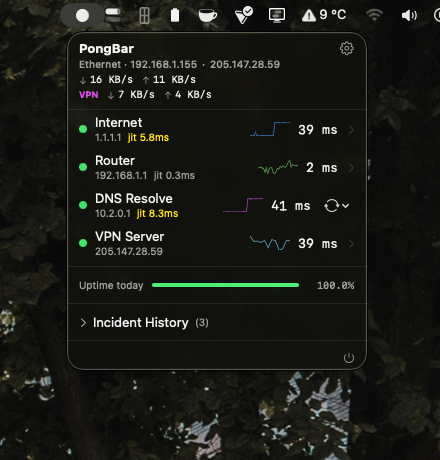
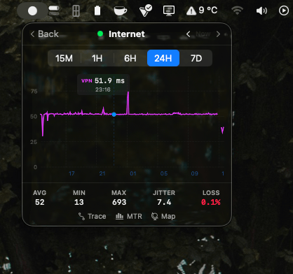
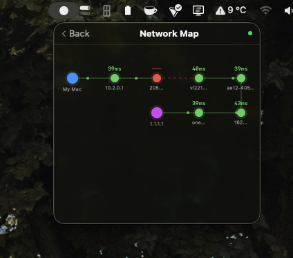
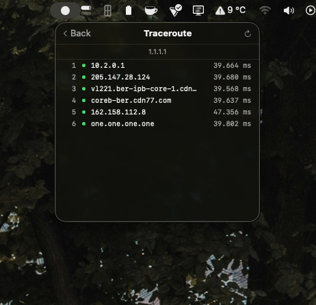

<p align="center">
  
</p>

<h1 align="center">PingPongBar</h1>

<p align="center">
  <b>Network monitoring that lives in your menu bar</b>
</p>

<p align="center">
  
  
  
</p>

<p align="center">
  A lightweight macOS menu bar app for real-time network monitoring. PingPongBar continuously tracks your internet connectivity, router health, DNS performance, and throughput — all from a tiny status icon in your menu bar.
</p>

---

## Features

- **Real-time latency monitoring** — Ping internet, router, and DNS targets every 3 seconds (configurable)
- **Packet loss tracking** — Rolling window packet loss percentage with spike detection
- **Jitter analysis** — Latency stability measurement using standard deviation of consecutive deltas
- **DNS performance** — Raw UDP DNS queries bypassing system cache for accurate RTT measurement
- **Throughput monitoring** — Per-interface upload/download speed via OS traffic counters
- **VPN-aware** — Automatic detection of VPN connections (WireGuard, OpenVPN, IKEv2, L2TP) with adapted monitoring
- **Traceroute & MTR** — On-demand traceroute and continuous My Traceroute sessions with per-hop statistics
- **Incident management** — Automatic outage detection with grace period, categorization, and notification alerts
- **Custom targets** — Add your own hosts to monitor alongside built-in targets
- **DNS switching** — Quick-switch DNS servers (Cloudflare, Google, Quad9, custom) with VPN support
- **Historical data** — SQLite-backed latency history with configurable retention (default 7 days)
- **Diagnostic reports** — One-click diagnostic report generation to clipboard
- **Network map** — Visual topology of your network path
- **Uptime tracking** — Per-target uptime percentage with visual bar chart

## Screenshots

<p align="center">
  
  &nbsp;&nbsp;
  
</p>

<p align="center">
  
  &nbsp;&nbsp;
  
</p>

| View | Description |
|------|-------------|
| **Dashboard** | Real-time status for all targets — latency, jitter, throughput, VPN, uptime, incidents |
| **Latency Chart** | Interactive 24h chart with avg/min/max stats, jitter, and packet loss |
| **Network Map** | Visual topology showing your device → router → ISP → internet path |
| **Traceroute** | Hop-by-hop route analysis with latency per node |

## Requirements

- macOS 14.0 (Sonoma) or later
- No special permissions required (uses subprocess-based ping, no raw sockets)

## Installation

### Build from Source

1. Clone the repository:
   ```bash
   git clone https://github.com/PrometheusSourse/PingPongBar.git
   cd PingPongBar
   ```
2. Open `PingPongBar.xcodeproj` in Xcode 15+
3. Build and run (⌘R)

The app will appear as a small colored dot in your menu bar.

## Usage

### Menu Bar Icon

The menu bar icon shows your network status at a glance:

| Icon Color | Meaning |
|------------|---------|
| 🟢 Green | All targets healthy, latency ≤ 50ms |
| 🟡 Yellow | Elevated latency (50–150ms) or minor issues |
| 🟠 Orange | High latency (> 150ms) or packet loss |
| 🔴 Red | Target unreachable or major outage |

Optionally display latency value or loss percentage next to the icon (configurable in Settings).

### Main Dashboard

Click the menu bar icon to open the popover dashboard:

- **Status rows** for each target (Internet, Router, DNS) with latency, jitter, and sparkline
- **Throughput row** showing real-time upload/download speed
- **Custom targets** section for user-defined hosts
- **Quick actions** — Traceroute, MTR, Network Map, Incident History, Diagnostic Report

### Detailed Views

Click any target row to see:
- Interactive latency chart with time range selection (5m, 15m, 1h, 6h, 24h, 7d)
- Statistics panel (avg, min, max latency, jitter, packet loss)
- Traceroute and MTR tools for that specific target

### Settings

Access via the gear icon or `⌘,`:

- **General** — Ping interval, timeout, menu bar display mode
- **Targets** — Custom internet host, DNS test domain
- **Thresholds** — Latency, jitter, packet loss, WiFi signal thresholds
- **DNS** — Quick-switch DNS servers with custom server support
- **Notifications** — Per-target enable/disable, cooldown period
- **Advanced** — Grace period, data retention, MTR settings, traceroute parameters

## Architecture

PingPongBar follows a modified MVVM pattern with SwiftUI's `@Observable` framework:

```
PingPongBarApp (Menu Bar Entry)
    │
    ▼
View Layer (16 SwiftUI views)
    │
    ▼
Observable Model Layer (NetworkMonitor → MetricsEngine, IncidentManager, ThroughputEngine)
    │
    ▼
Service Layer (12 stateless enum services)
    │
    ▼
Storage Layer (SQLiteStorage with WAL mode)
    │
    ▼
Configuration (Config enum → UserDefaults)
```

### Key Design Decisions

- **Single snapshot per tick** — One `getifaddrs()` call shared across all services per monitoring cycle
- **Subprocess-based ping** — Uses `/sbin/ping` instead of raw ICMP sockets, requiring no special permissions
- **Raw UDP DNS queries** — Bypasses system cache for accurate DNS RTT measurement
- **Grace period for incidents** — Configurable consecutive failures before alerting (prevents false positives during network switching)
- **Batched SQLite writes** — Samples queued and flushed in a single transaction per tick

For detailed architecture documentation, see [docs/ARCHITECTURE.md](docs/ARCHITECTURE.md).

## Project Structure

```
PingPongBar/
├── PingPongBarApp.swift              # App entry point, MenuBarExtra setup
├── Config.swift                  # Centralized configuration with UserDefaults
├── Models/
│   ├── NetworkMonitor.swift      # Central orchestrator, main monitoring loop
│   ├── MetricsEngine.swift       # Rolling metrics computation (jitter, loss)
│   ├── IncidentManager.swift     # Outage detection and lifecycle management
│   ├── ThroughputEngine.swift    # Per-interface throughput calculation
│   ├── PingTarget.swift          # Target enum and PingResult type
│   ├── Incident.swift            # Incident data model with categorization
│   ├── LatencySample.swift       # Persistent latency sample type
│   └── CustomTarget.swift        # User-defined target model
├── Views/
│   ├── PopoverContentView.swift  # Root popover with manual navigation
│   ├── MainStatusView.swift      # Dashboard with all status rows
│   ├── StatusRowView.swift       # Individual target status row
│   ├── DNSRowView.swift          # DNS status with server switcher
│   ├── TargetDetailView.swift    # Latency chart and stats for built-in targets
│   ├── CustomTargetDetailView.swift
│   ├── SparklineView.swift       # Inline latency sparkline chart
│   ├── TracerouteView.swift      # Traceroute results display
│   ├── MTRView.swift             # Continuous MTR session view
│   ├── NetworkMapView.swift      # Network topology visualization
│   ├── IncidentHistoryView.swift # Past incidents list
│   ├── UptimeBarView.swift       # Visual uptime percentage bar
│   ├── StatBadge.swift           # Compact stat display badge
│   ├── CustomTargetRowView.swift # Custom target status row
│   ├── ThroughputRowView.swift   # Upload/download speed display
│   └── SettingsView.swift        # Preferences window
├── Services/
│   ├── PingService.swift         # ICMP ping via /sbin/ping subprocess
│   ├── DNSResolveService.swift   # Raw UDP DNS query with RTT measurement
│   ├── GatewayService.swift      # Default gateway from kernel routing table
│   ├── NetworkInterfaceService.swift  # Interface type, IP, WiFi SSID/RSSI
│   ├── ThroughputService.swift   # Traffic counter extraction
│   ├── InterfaceSnapshot.swift   # Single getifaddrs() capture per tick
│   ├── TracerouteService.swift   # On-demand traceroute
│   ├── MTRService.swift          # Continuous MTR session management
│   ├── SQLiteStorage.swift       # Persistent storage with WAL mode
│   ├── NotificationService.swift # macOS notification delivery
│   ├── PublicIPService.swift     # Public IP address detection
│   ├── DNSSwitcherService.swift  # DNS server switching (networksetup/scutil)
│   └── DiagnosticReportService.swift  # Report generation
└── Helpers/
    ├── HostValidator.swift       # Input validation, injection prevention
    ├── OutputBox.swift           # Thread-safe subprocess output capture
    ├── LatencyStats.swift        # Statistics computation and downsampling
    ├── ModelColors.swift         # Color extensions for models
    └── Formatters.swift          # Date, duration, throughput formatters
```

## Configuration Reference

All values are configurable via Settings UI or `defaults write` commands. See [docs/CONFIGURATION.md](docs/CONFIGURATION.md) for the complete reference.

| Parameter | Default | Description |
|-----------|---------|-------------|
| Ping Interval | 3s | Time between monitoring cycles |
| Ping Timeout | 2s | Per-ping timeout |
| DNS Timeout | 3s | DNS query timeout |
| Latency Good | ≤ 50ms | Green threshold |
| Latency Fair | ≤ 150ms | Yellow threshold |
| Grace Period | 3 pings | Consecutive failures before incident |
| Data Retention | 7 days | SQLite sample retention |
| Notification Cooldown | 30s | Min time between alerts per target |

## Tech Stack

- **Language**: Swift 5.9+
- **UI Framework**: SwiftUI with `@Observable` (Observation framework)
- **Storage**: SQLite3 (C API, WAL mode, prepared statements)
- **Networking**: POSIX sockets (DNS), subprocess (`ping`, `traceroute`), `NWPathMonitor`
- **System APIs**: `getifaddrs()`, `sysctl()`, `SCDynamicStore`, `CoreWLAN`
- **Notifications**: `UNUserNotificationCenter`

## License

This project is licensed under the MIT License — see the [LICENSE](LICENSE) file for details.

## Contributing

Contributions are welcome! Please read the [Contributing Guide](CONTRIBUTING.md) before submitting a pull request.
